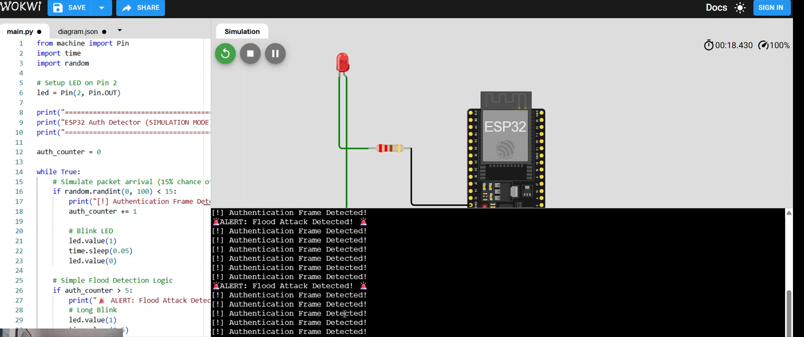

# ESP32 WiFi Authentication Frame Detector (Simulation)

## 📌 Project Overview
This project is a cybersecurity simulation tool designed to detect **Authentication Flood Attacks** (a type of Denial of Service) on WiFi networks. Using an ESP32 and MicroPython, the system simulates "sniffing" WiFi management frames. If it detects a high volume of Authentication Frames (Packet ID `0xB0`) in a short period, it triggers a visual alarm (LED) to warn of the attack.

## 🧰 Equipment & Resources
- **Simulator:** [Wokwi.com](https://wokwi.com) (Browser-based ESP32 simulator)
- **Language:** MicroPython (Used to bypass build server limitations)
- **Hardware (Simulated):** ESP32 DevKit V1, Red LED, 220Ω Resistor

## ⚙️ Steps I Followed

1.  **Setup:** Opened Wokwi.com and started a new **MicroPython on ESP32** project.
2.  **Wiring:** Connected a Red LED to GPIO 2 (D2) and grounded it through a 220Ω resistor.
3.  **Coding:** Wrote a Python script to simulate WiFi packet arrival. The script randomly generates "dummy packets" and counts how many "Authentication Frames" appear.
4.  **Testing:** Ran the simulation. The system successfully detected the simulated flood attack and triggered the LED alarm.

## 🔧 Troubleshooting & Challenges

### Challenge 1: Compilation Timeouts
*   **Issue:** Initially attempted to use C++ (Arduino framework), but the free tier of the Wokwi build servers was overloaded, causing "Build Server Busy" errors.
*   **Solution:** Pivoted to **MicroPython**. Since Python is interpreted directly in the browser, it bypasses the heavy compilation queue, allowing for instant and reliable simulation testing.

### Challenge 2: LED Visibility
*   **Issue:** The LED blink was initially too fast (50ms) to see clearly in the simulation.
*   **Solution:** Adjusted the `time.sleep()` duration from `0.05` to `0.5` seconds to make the visual alert distinct and clear in the demonstration video.

## 📸 Proof of Concept

## 🎥 Video Demonstration
[Click here to watch the Project Video](CSN-150%20FINAL%20PROJECT.mkv)
